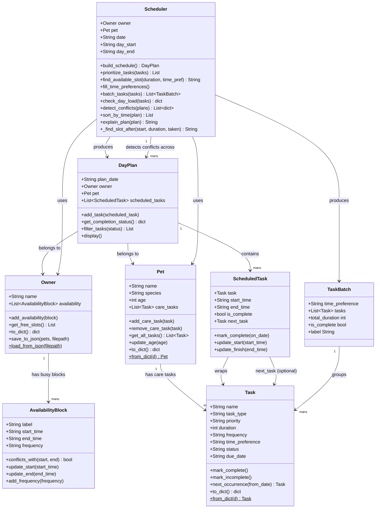

```mermaid
classDiagram
    class Task {
        +String name
        +String task_type
        +String priority
        +int duration
        +String frequency
        +String time_preference
        +String status
        +String due_date
        +mark_complete()
        +mark_incomplete()
        +next_occurrence(from_date) Task
        +to_dict() dict
        +from_dict(d) Task$
    }

    class Pet {
        +String name
        +String species
        +int age
        +List~Task~ care_tasks
        +add_care_task(task)
        +remove_care_task(task)
        +get_all_tasks() List~Task~
        +update_age(age)
        +to_dict() dict
        +from_dict(d) Pet$
    }

    class AvailabilityBlock {
        +String label
        +String start_time
        +String end_time
        +String frequency
        +conflicts_with(start, end) bool
        +update_start(start_time)
        +update_end(end_time)
        +add_frequency(frequency)
    }

    class Owner {
        +String name
        +List~AvailabilityBlock~ availability
        +add_availability(block)
        +get_free_slots() List
        +to_dict() dict
        +save_to_json(pets, filepath)
        +load_from_json(filepath)$
    }

    class ScheduledTask {
        +Task task
        +String start_time
        +String end_time
        +bool is_complete
        +Task next_task
        +mark_complete(on_date)
        +update_start(start_time)
        +update_finish(end_time)
    }

    class TaskBatch {
        +String time_preference
        +List~Task~ tasks
        +total_duration int
        +is_complete bool
        +label String
    }

    class DayPlan {
        +String plan_date
        +Owner owner
        +Pet pet
        +List~ScheduledTask~ scheduled_tasks
        +add_task(scheduled_task)
        +get_completion_status() dict
        +filter_tasks(status) List
        +display()
    }

    class Scheduler {
        +Owner owner
        +Pet pet
        +String date
        +String day_start
        +String day_end
        +build_schedule() DayPlan
        +prioritize_tasks(tasks) List
        +find_available_slot(duration, time_pref) String
        +fill_time_preferences()
        +batch_tasks(tasks) List~TaskBatch~
        +check_day_load(tasks) dict
        +detect_conflicts(plans) List~dict~
        +sort_by_time(plan) List
        +explain_plan(plan) String
        +_find_slot_after(start, duration, taken) String
    }

    Pet "1" --> "many" Task : has care tasks
    Owner "1" --> "many" AvailabilityBlock : has busy blocks
    ScheduledTask --> Task : wraps
    ScheduledTask --> Task : next_task (optional)
    DayPlan --> Owner : belongs to
    DayPlan --> Pet : belongs to
    DayPlan "1" --> "many" ScheduledTask : contains
    TaskBatch "1" --> "many" Task : groups
    Scheduler --> Owner : uses
    Scheduler --> Pet : uses
    Scheduler --> DayPlan : produces
    Scheduler --> TaskBatch : produces
    Scheduler "1" --> "many" DayPlan : detects conflicts across
```
