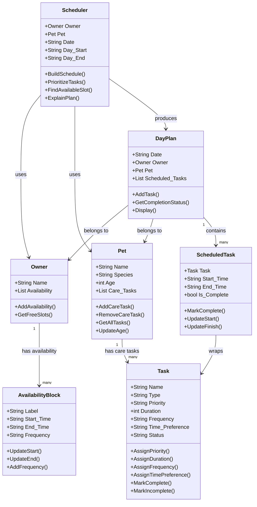

```mermaid
classDiagram
    class Pet {
        +String Name
        +String Species
        +int Age
        +List Care_Tasks
        +AddCareTask()
        +RemoveCareTask()
        +GetAllTasks()
        +UpdateAge()
    }

    class Task {
        +String Name
        +String Type
        +String Priority
        +int Duration
        +String Frequency
        +String Time_Preference
        +String Status
        +AssignPriority()
        +AssignDuration()
        +AssignFrequency()
        +AssignTimePreference()
        +MarkComplete()
        +MarkIncomplete()
    }

    class Owner {
        +String Name
        +List Availability
        +AddAvailability()
        +GetFreeSlots()
    }

    class AvailabilityBlock {
        +String Label
        +String Start_Time
        +String End_Time
        +String Frequency
        +UpdateStart()
        +UpdateEnd()
        +AddFrequency()
    }

    class ScheduledTask {
        +Task Task
        +String Start_Time
        +String End_Time
        +bool Is_Complete
        +MarkComplete()
        +UpdateStart()
        +UpdateFinish()
    }

    class DayPlan {
        +String Date
        +Owner Owner
        +Pet Pet
        +List Scheduled_Tasks
        +AddTask()
        +GetCompletionStatus()
        +Display()
    }

    class Scheduler {
        +Owner Owner
        +Pet Pet
        +String Date
        +String Day_Start
        +String Day_End
        +BuildSchedule()
        +PrioritizeTasks()
        +FindAvailableSlot()
        +ExplainPlan()
    }

    Pet "1" --> "many" Task : has care tasks
    Owner "1" --> "many" AvailabilityBlock : has availability
    ScheduledTask --> Task : wraps
    DayPlan --> Owner : belongs to
    DayPlan --> Pet : belongs to
    DayPlan "1" --> "many" ScheduledTask : contains
    Scheduler --> Owner : uses
    Scheduler --> Pet : uses
    Scheduler --> DayPlan : produces
```
